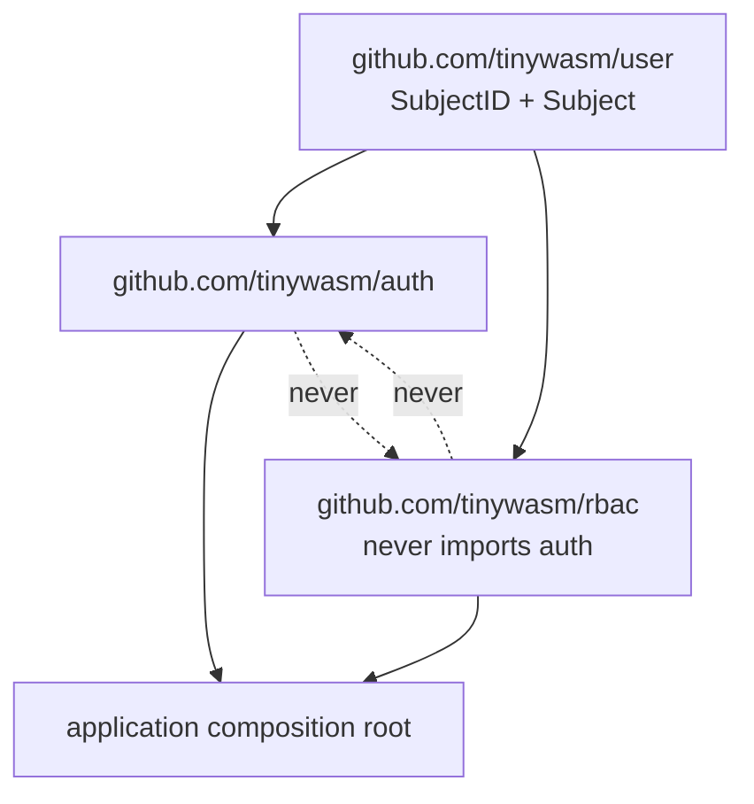
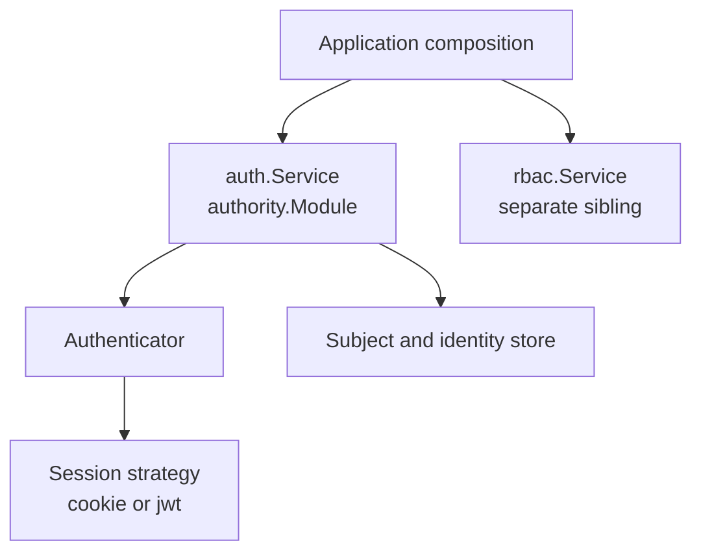

# Architecture

`tinywasm/auth` owns authentication mechanisms: subjects and their external
identities, login flows, session lifecycle, OAuth state, and concrete providers.
It depends on `tinywasm/user` only for the stable `Subject` value contract.

It never decides roles or permissions. Applications compose its authentication
middleware with `tinywasm/rbac` explicitly. `auth` and `rbac` are siblings;
neither imports the other.

## Dependency Direction

Rules:

- `user` imports neither `auth` nor `rbac`.
- `auth` imports `user`; it may depend on `orm`, `fetch`, `jwt`, `sqlite`,
  `crypto`, and provider packages. It never imports `rbac`.
- `rbac` imports `user`; it may depend on its own persistence. It never imports
  `auth`.
- Only the composition root imports both.

## Packages

- `auth`: service, persistence, session middleware, and shared login ports
  (`SubjectStore`, `SessionIssuer`, `IdentityStore`, `StateStore`,
  `SecurityNotifier`, `SessionRepo`).
- `authority`: concrete `Module` implementing the ports; owns `user`, `session`,
  `identity`, `lanip`, `oauth_state` tables and the session cache. The session cache
  is strictly read-through (`GetSession` loads on miss) and is intentionally not
  pre-warmed on module construction to avoid costly table scans in short-lived isolate
  environments. Schema DDL is reconciled explicitly via `authority.Migrate` at deploy
  time; `New` assumes the schema already exists and performs no database queries.
- `oauth2`: OAuth authorization-code flow (begin/callback, state handling).
- `oauth2/provider/*`: concrete Google and Microsoft protocol adapters.
- `session/*`: concrete session transports (`cookie`, `jwt`).
- `email_password`: email+password credential authenticator.
- `trusted_ip`: RUT + IP allowlist authenticator.
- `local`: deterministic development login scenarios; it never contacts Google,
  never uses `fetch`, and has no environment variables.

## Local Simulator

`auth/local` receives an explicit slice of immutable `Scenario` values (stable
subject identifier, display name, email, avatar, display role labels), an
`auth.SubjectStore`, an `auth.SessionIssuer`, and an explicit `AfterLogin`
route. It exposes `ProviderName`, `PathStart`, and `PathSelect`. The GET route
serves a minimal selector; the POST route validates the identifier against the
configured slice, rejects unknown/empty with a deterministic 400, resolves or
creates the identity through `SubjectStore`, calls `SessionIssuer.IssueSession`,
and redirects to `AfterLogin`. It never assigns roles.

## Security Events

All modes report `SecurityEvent` on `TopicSecurity = "auth.security"` via the
optional `events.Publisher` injected in `auth.Config`. `nil` drops events.
